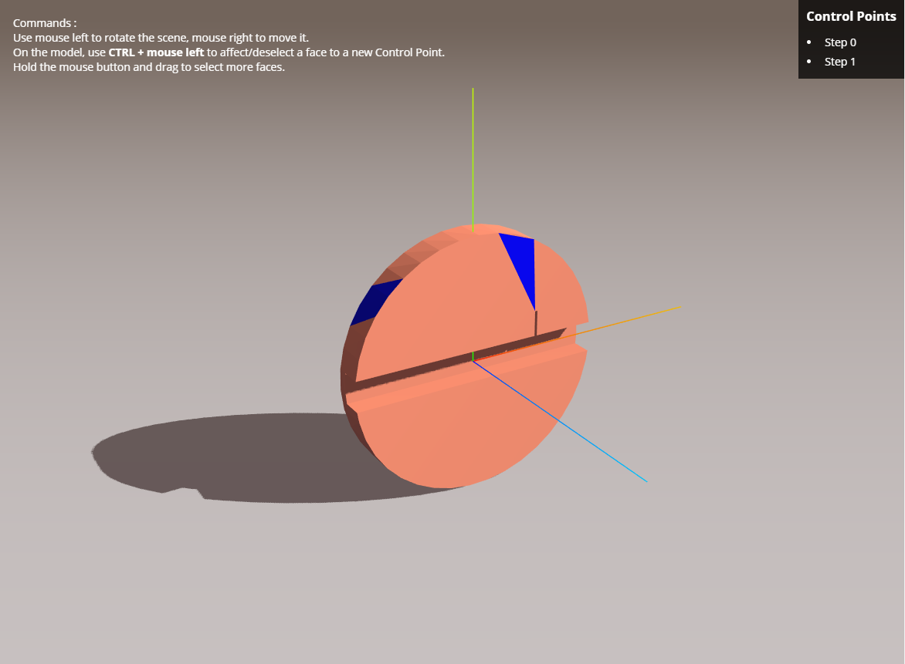

# WebGL Area Picking

Ideally run with _Live Server_ VSCode extension.

## Useful sources

- [Main ThreeJS documentation](https://threejs.org/docs)
- [Mouse controls with dragging and axes](https://threejs.org/examples/misc_controls_transform.html)
- [Fluid orientation changes](https://threejs.org/examples/#webgl_math_orientation_transform)
- [wireframe](https://threejs.org/examples/#webgl_geometry_convex)
- [wireframe](https://threejs.org/examples/#webgl_lines_fat_wireframe)
- (https://threejs.org/examples/?q=raycast#webgl_raycast_texture)
- (https://threejs.org/examples/#webgl_interactive_buffergeometry)
- [add an object](https://threejs.org/examples/#webgl_interactive_voxelpainter)
- [precision using nb faces](https://threejs.org/examples/#webgl_modifier_subdivision)
- [comparison to show defects](https://threejs.org/examples/#webgl_multiple_scenes_comparison)
- (https://threejs.org/examples/#webgl_nearestneighbour)
- [Explanations why can not color faces with BufferGeometries](https://stackoverflow.com/questions/41670308/three-buffergeometry-how-do-i-manually-set-face-colors#answer-41682130)
- [Docs BufferAttribute](https://threejs.org/docs/index.html#api/en/core/BufferAttribute)
- [Color on click](https://stackoverflow.com/questions/50118025/changing-color-of-points-in-a-particle-system-dynamically#answer-50118263)
- [color multiple faces with dragging mouse](https://jsfiddle.net/Shaggisu/w7ufmutr/9/)
